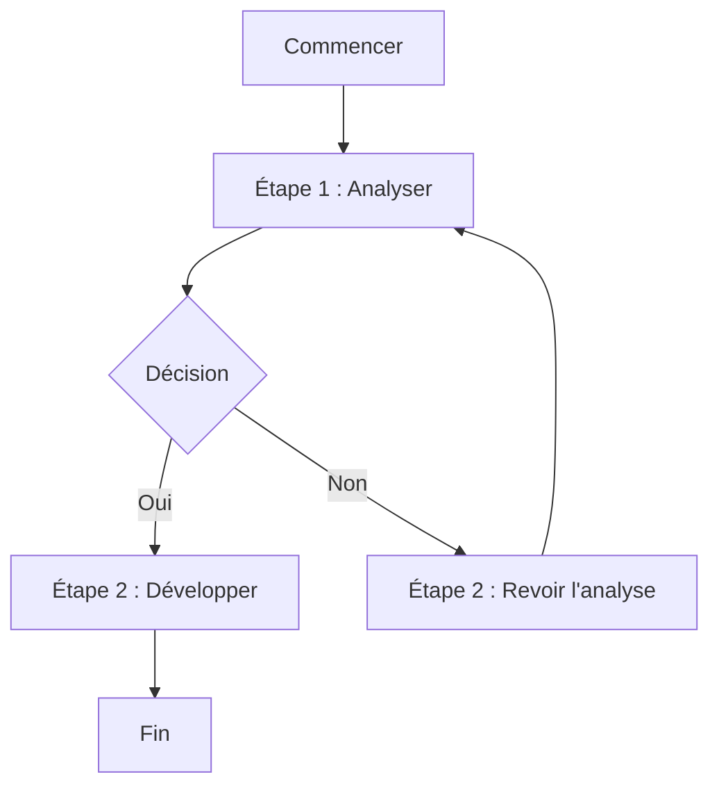

<div style="text-align:center; border:5px solid red">


## faculte des sciences et technologies
### TD1 Reseau 2

#### *Nom :* PIERRE
#### *Prenom :* Yann Lelay 
#### *Niveau :* L3-Sciences Informatiques 


</div>

\newpage

# Reponse Quetion 1
## *Créer un document avec des titres, du texte mis en forme, des listes ,listes imbriquées, séparateurs , des liens, badges et en ajoutant une image*

## La vie d'un développeur 

### Etre un developpeur : 
**Être développeur**, c'est bien plus qu'écrire des lignes de code ! C'est un métier passionnant qui allie créativité, rigueur et résolution de problèmes. Explorons le quotidien d'un développeur, ses défis, ses réussites, et ses outils.


## Quotidien d'un développeur 

### Les tâches principales :
- **Analyser** les besoins des clients ou des projets.
- **Développer** 
  - fonctionnalites apk
  - fonctionnalites site web
- **Tester** et corriger les bugs.
- **Collaborer** avec des équipes pluridisciplinaires.

### Les moments forts :
1. La joie de résoudre un bug complexe. 
2. Le stress des deadlines imminentes. ~
3. La satisfaction de voir un projet finalisé. 


### Les outils indispensables 

Un développeur utilise une variété d'outils pour exceller :
- **Environnement de Développement Intégré (IDE)** : comme Visual Studio Code ou JetBrains.
- **Gestion de version** : avec des outils comme Git et GitHub.
- **Outils de communication** : Slack, Teams, etc.
- **Systèmes d'intégration continue** : Jenkins, CircleCI.


## Défis et apprentissages constants 

### Défis fréquents :
- S'adapter aux nouvelles technologies.
- Trouver un équilibre entre la qualité du code et le respect des délais.

### Stratégies de survie :
- Apprendre en continu.
- Partager et collaborer avec la communauté.

### Ressources :
- Des forums comme [Stack Overflow](https://stackoverflow.com).
- Des cours en ligne : [freeCodeCamp](https://www.freecodecamp.org).


## Les moments de détente 

Parce qu'un développeur sait aussi prendre des pauses !
- Jouer à des jeux vidéo .
- Découvrir de nouvelles passions (musique, jardinage, etc.).
- Recharger ses batteries pour repartir coder !


## Motivation et Inspiration 

- Badge :   
- Citation : *"Le code est comme la poésie : chaque ligne a son propre rythme."*


## Une image qui parle 

cette image résume bien l'esprit d'un développeur :


## En Resume :
La vie d'un développeur est intense, mais chaque ligne de code résolue apporte sa dose de satisfaction. Avec de la passion et un brin de caféine, tout est possible !

---


# Reponse Quetion 2

## *Créer un tableau Markdown avec des données fictives et rédiger un texte avec citations*

| Heure        | Activité                          | Détails                           |
|--------------|-----------------------------------|-----------------------------------|
| 08:00 - 09:00 | Café et planification            | Préparer la liste des tâches .  |
| 09:00 - 12:00 | Développement                   | Travail sur une API RESTful .    |
| 12:00 - 13:00 | Pause déjeuner                   | Déconnecter et reprendre de l'énergie . |
| 13:00 - 15:00 | Révision de code (code review)   | Collaboration avec l'équipe .   |
| 15:00 - 16:30 | Debugging                        | Résolution d'un bug critique .  |
| 16:30 - 18:00 | Étude de nouvelles technologies | Se former sur Kubernetes .      |
 
### textes avec  citations

Le rôle du développeur va bien au-delà d'écrire du code. Il s'agit d'un art mêlant logique et créativité. Steve Jobs l'a exprimé avec éloquence : 
 > "Tout le monde devrait apprendre à programmer, car cela vous apprend comment penser."

--- 

#  Reponse question 3

## *Créer une liste de tâches à cocher ,Inclure un bloc de code avec une spécification de langage et inclure une syntaxe HTML.*

## Liste de tâches et exemples 

### Liste de tâches à cocher 
- [x] Lire la documentation sur **Markdown**.
- [ ] Configurer l'environnement de développement.
- [x] Tester une application avec **Node.js**.
- [x] Explorer les nouvelles fonctionnalités de HTML5.
- [x] Faire une pause café .

---

## Exemple de bloc de code (Python) 
code Python :

```python
# Liste de tâches en Python
tasks = [
    {"task": "Lire la documentation sur Markdown", "done": False},
    {"task": "Configurer l'environnement de développement", "done": True},
    {"task": "Tester une application avec Node.js", "done": True},
Tr]

# Affichage des tâches
for task in tasks:
    status = "v" if task["done"] else "x"
    print(f"{status} {task['task']}")
    
```

## code Html

<h1>Ma  Liste de tache</h1>
<ul>
    <li> Lire la documentation sur Markdown</li>
    <ul>
        <li> Configurer l'environnement </li>
        <li>Installer Python</li>
        <li>Mettre à jour les dépendances</li>
    </ul>
    <li>Tester une application</li>
    <li>Faire une pause pour le cafe</li>
</ul>


# Reponse Question 4

## *Créer un fichier Markdown incluant des tables des matières et ajouter un diagramme Mermaid dans un document.*

# Document Markdown avec Table des Matières et Diagramme Mermaid

## Table des Matières
- [Introduction](#introduction)
- [Contexte](#contexte)
- [Diagramme Mermaid](#diagramme-mermaid)
- [Conclusion](#conclusion)

---

## Introduction
Ce document est un exemple qui montre comment utiliser **Markdown** pour structurer des contenus avec une table des matières et inclure un diagramme Mermaid pour une visualisation interactive. 

Les outils comme Mermaid permettent de générer des diagrammes de manière simple, ce qui est particulièrement utile pour représenter des flux, des hiérarchies, ou des dépendances.

---

## Contexte
Markdown est largement utilisé dans la documentation technique, car il est facile à lire et à écrire. L'intégration de Mermaid dans les fichiers Markdown donne aux développeurs la possibilité d'ajouter des diagrammes directement dans leurs documents.

---

## Diagramme Mermaid



---

### Resultat diagramme 


---


## Conclusion : 

Ce devoir m'a permis de mettre en pratique plusieurs aspects fondamentaux de la création de documents en Markdown. j'ai exploré la structuration et la mise en forme de textes, l'intégration de listes imbriquées, de liens, de badges et d'images, ainsi que la création de tableaux et de diagrammes interactifs avec Mermaid.