# Institut Universitaire des Sciences

## Faculté  sciences et technologies

### Rapport TD5 reseau 2

### Préparé par :

### Nom : PIERRE
### Prénom : Yann Lelay
### Niveau : L3 - Sciences Informatiques

----

# 1. Reproduisez cette topologie en implémentant le Protocole de Routage OSPF dans un Réseau!

1. Topologie du réseau :
   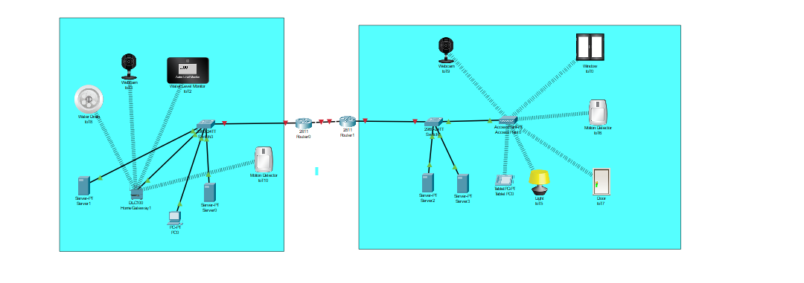
2. Configuration les points Acces et les IOT
   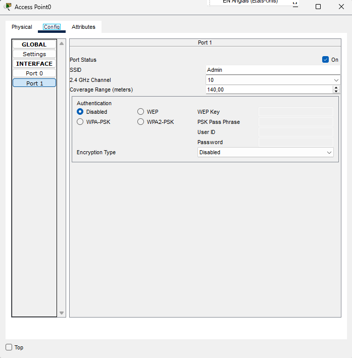
   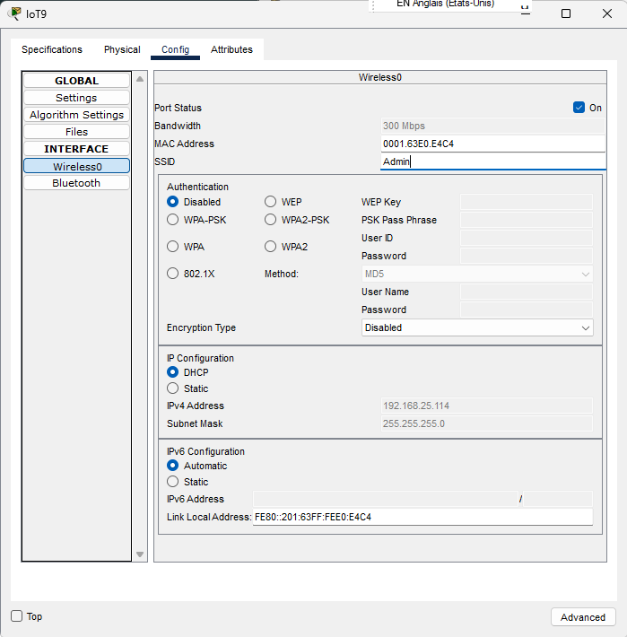
   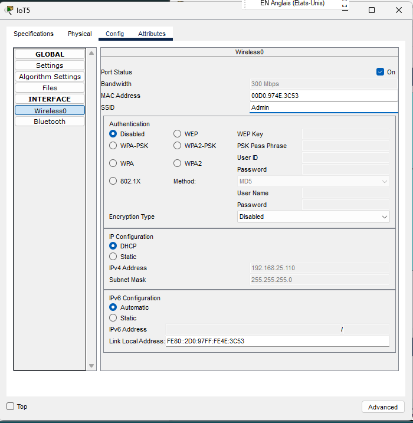
   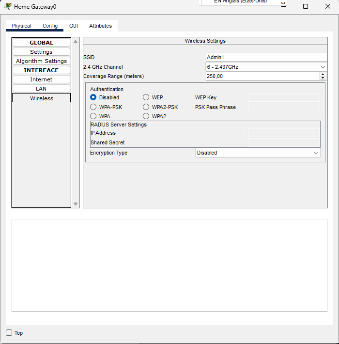
   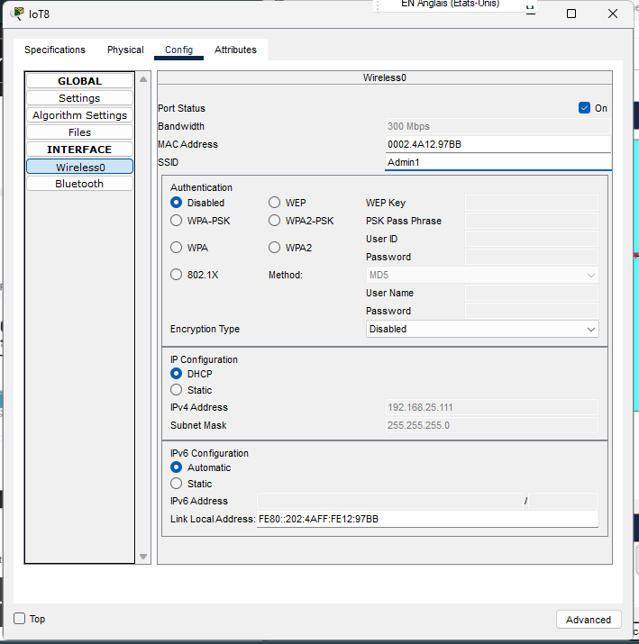
   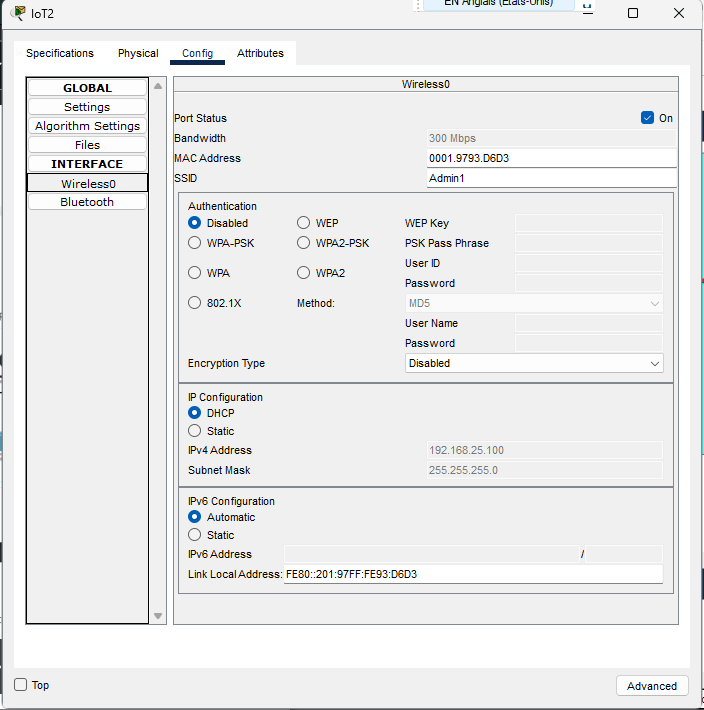

3. Configuration des serveurs DHCP et IOT
   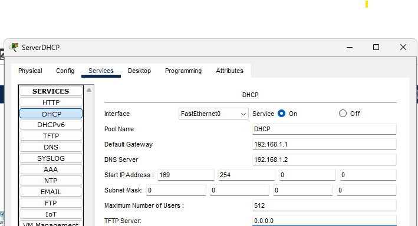
   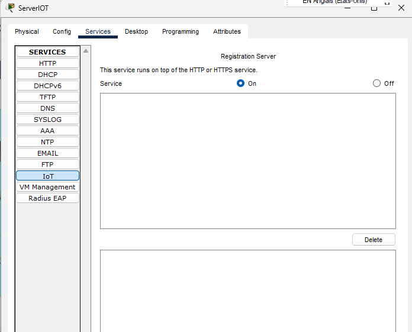
4. Configuration de base des routeurs
   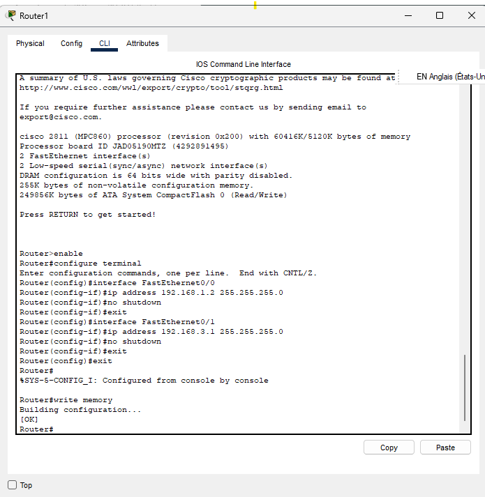
5. Configuration du protocole OSPF
   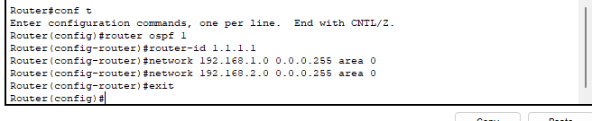
   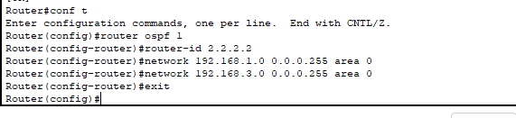
6. Vérification de la configuration OSPF
   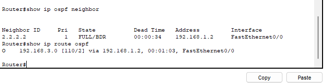
   
   
 
# REPONSE Q2

# 2. Reproduisez cette topologie en configurant le réseau IoT (Internet des Objets).
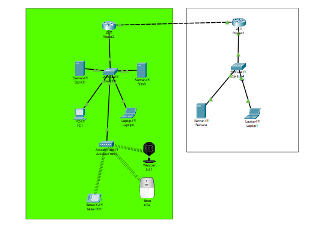{width=95%}

## Configuration du point Acces
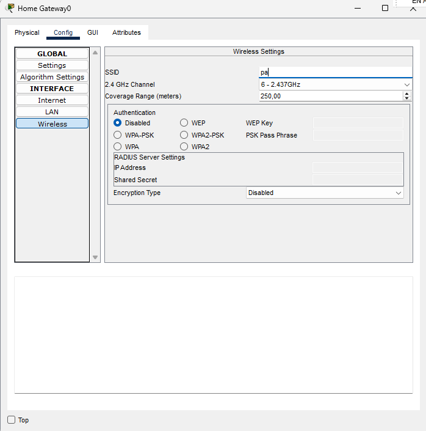{width=95%}

## Activation des services IOT
{width=95%}

## Registration au server
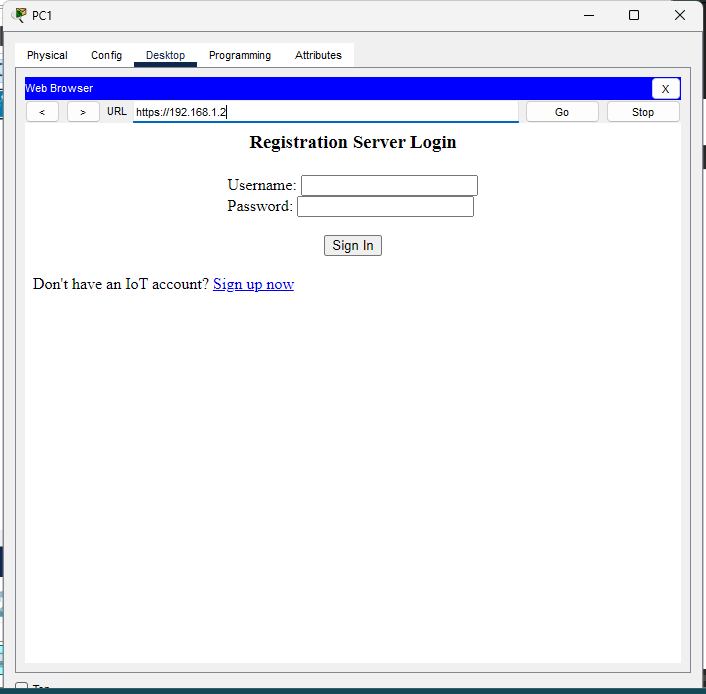{width=95%}
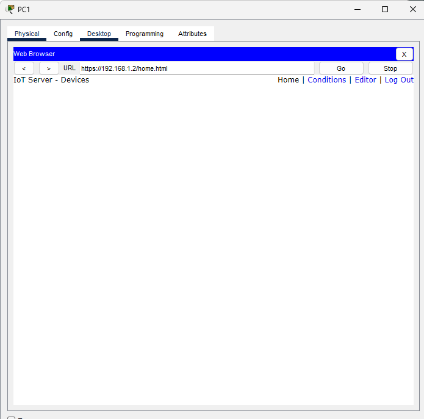{width=95%}

## Configurer les IOT
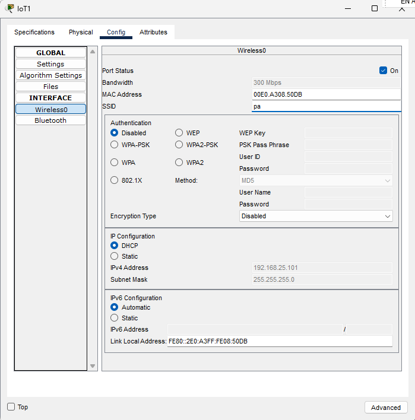{width=95%}
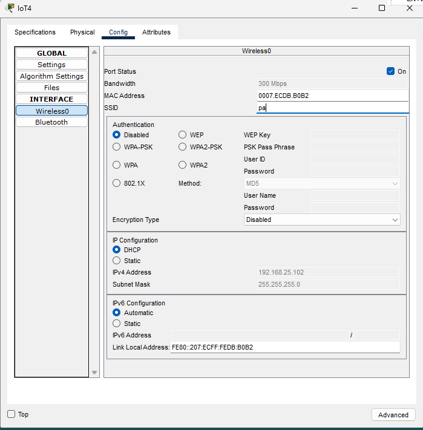{width=95%}
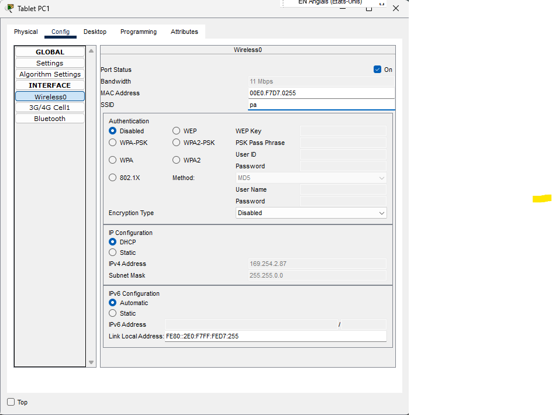{width=95%}

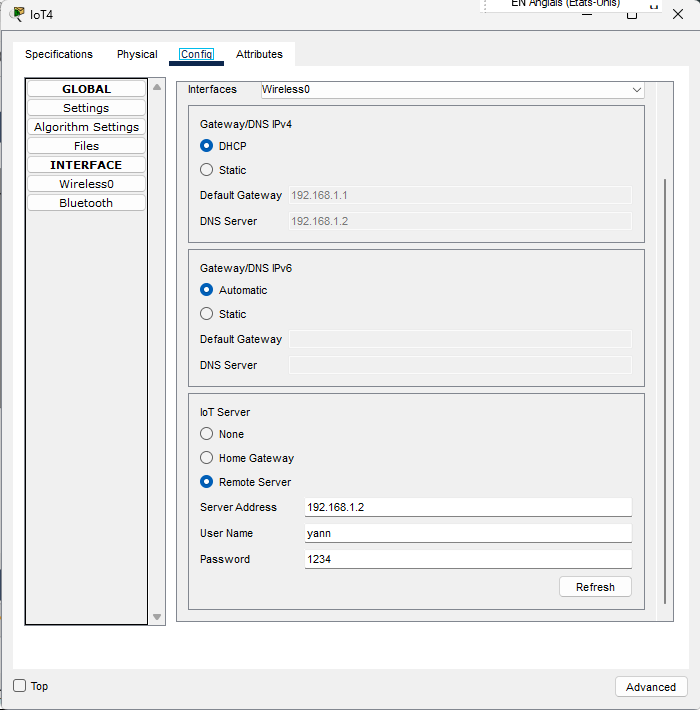{width=95%}
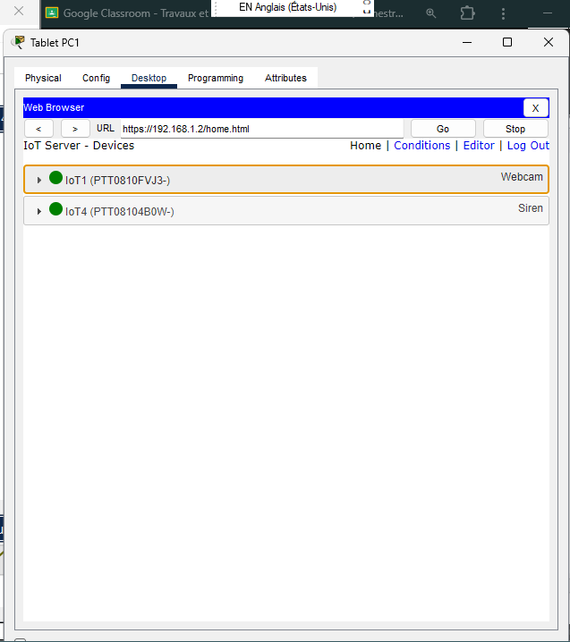{width=95%}

---

# Conclusion

Ce TD m'a permis d'explorer la configuration réseau avec OSPF et des IoT, consolidant mes compétences techniques essentielles en connectivité.
